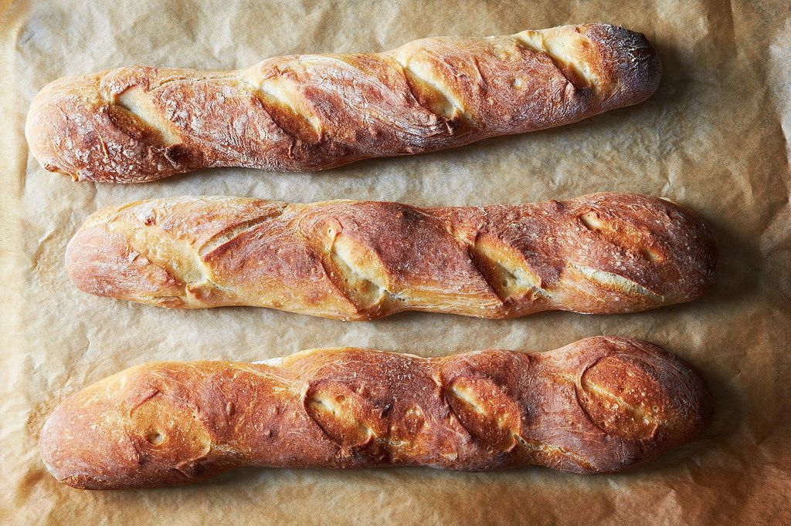

# Bread

## Ingredients  

- Flour - 1kg
- Water ~ 750ml
- Dry Yeast* - 3/4 teaspoons or ~2gr  
- Salt - 2 teaspoons  

***Yeast** - this is for **dry** yeast, multiply by 3x if using wet yeast

## Preparation  

Prepare the dough ~8-10h before cooking

1. Mix the flour, yeast, and salt in 1 bowl
2. Add the water, stirr with a wooden stick until it's all a more or less mixed, should be
   quick, max 2min, just make sure there is no bunch of dry flour on the bottom.
3. Cover the bowl with plastic wrap or a cover, and let it rest at room temperature for 8
   to 10h
  
---

4. Spread flour over a surface and place the dough on it, gently, do not break the bubbles.  
5. Sprinkle more flour over the dough generously.  
6. Using a spatula or similar, gently make sure the dough is not sticking to the counter,
   and softly give it into an oval shape.
7. With the spatula, cut it into 3-4 pieces, and carefully place them on the oven tray,
   flipping them, stretch them slightly to give them a baguette shape. Feel free to make
   some cuts on the top

---

8. Cook in a pre-heated oven to 230-250C (with convection) for ~25min or until nicely colored
