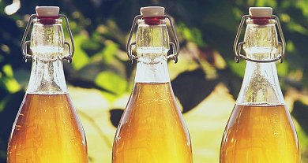

# Mead (5L)

## Ingredients  

- Honey - 800 to 1400g, depending on how dry or sweet you want the mead  
- Water  
- Yeast - Half a package  
- Yeast Nutrient or 10 raisins  
- Salt - 1.5 teaspoon  

## Preparation  
---

1. Sanitize everything (fermeting jug, airlock, pot, spoons, funnels).  
  
---

2. Add ~2.5L of clean filtered water in large pot at medium heat.  
3. When the water is warm, but not boiling, add honey and stirr. Turn off the heat.  
4. (optional) Add ginger, berries, or other spices into the fermenting jug.  
5. Add the yeast nutrient or the raisins.  
6. Using a funnel, pour the honey water into the jug, and top off with cold water, make sure to leave space for the foam, and mix.  
7. When the jug's contents are no longer warm (~32C), add the yeast, and put on the airlock.
8. Ferment for 5-6 weeks, until there are no more bubbles.

---

9. After the fermentation, bottle the mead in (sanitized) bottles.  
10. You can drink the mead young, but it gets better with time, so you might want to let it age for a few months or even a year.
11. Drink!
