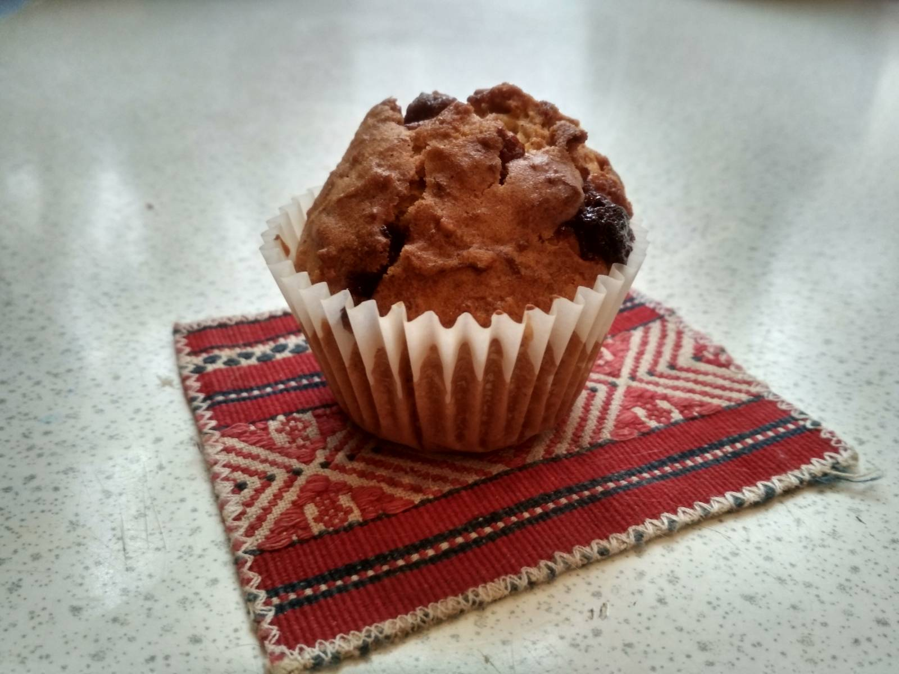

# Carrot Muffins

## Ingredients  
  -  2 szklanki startej marchewki (na małych oczkach jarzynowych)
  -  1 i ½ szklanki mąki pszennej lub jasnej orkiszowej
  -  1 szklanka drobnego cukru do wypieków
  -  ½ łyżeczki proszku do pieczenia
  -  ½ łyżeczki sody
  -  ½ łyżeczki cynamonu
  -  szczypta soli
  
  -  ½ szklanki oleju rzepakowego
  -  3 małe jajka w temp. pokojowej

  -  garść posiekanych orzechów włoskich i suszonej żurawiny (lub rodzynek)
  -  opcjonalnie polewa: 75 g białej czekolady, 3 łyżki śmietanki 30%

## Preparation

Marchewkę obieramy i trzemy na tarce jarzynowej o drobnych oczkach. 
Przekładamy na sitko i odciskamy z nadmiaru soku. 
W jednej misce mieszamy składniki suche, w drugiej mokre. 
Mieszamy byle jak, to zapewni nam wilgotne muffinki w środku.
Pieczemy ok. 25-30 min. w 180°C.
