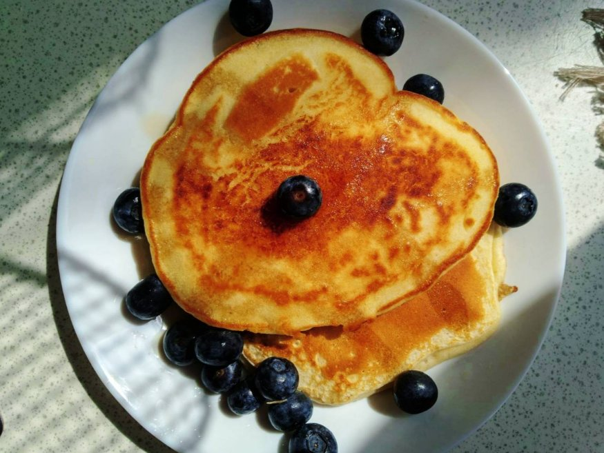

# Pancakes (American)

## Ingredients
- 400ml flour
- 3-4 teaspoons of baking powder
- A pinch of salt
- 1 egg
- 300ml milk
- 60ml butter
- Vanilla (optional)

## Preparation

1. Mix the flour, baking powder and salt in a large bowl and leave to rest aside  
2. In a different bowl, whisk the egg and add the milk  
3. Add the butter (melted) and vanilla to the egg and milk, and mix until it has a uniform consistency  
4. Mix the liquid ingredients into the dry mix, and slowly mix with a wooden spoon or similar, until there are no large lumps, but so much that it is too uniform
5. Cook on a pan with butter, 2-3 min on each side
