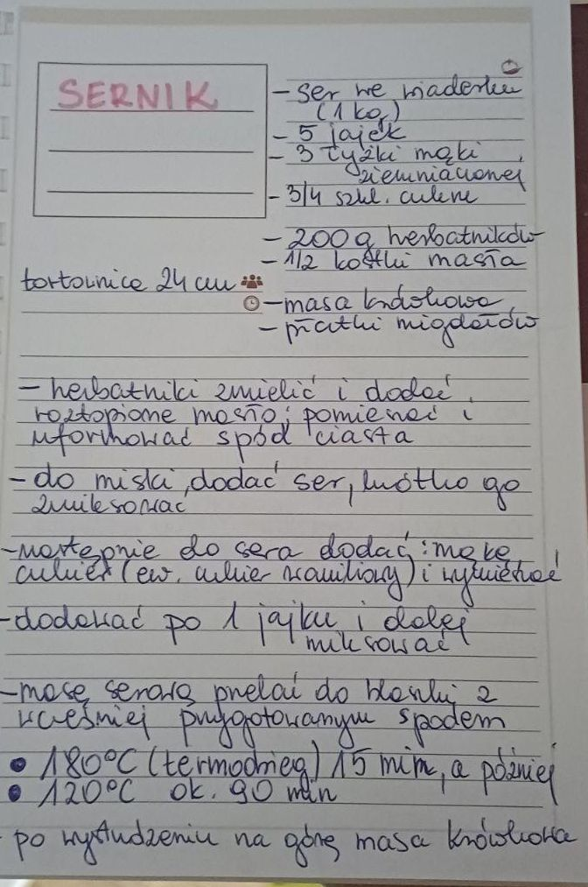

# Sernik Agaty Kaczmarek na spodzie z herbatników

## Składniki
Tortownica 24cm
 - ser sernikowy, wszystko jedno jaki, ponoć Lidlowy wychodzi pycha
 - 5 jaj
 - 200g herbatników - pokruszonych
 - pół masła
 - 3 łyżki mąki ziemniaczanej
 - 3/4 szklanki cukru
 - czekolada do rozpuszczenia na góre
 - płatki migdałów

## Wykonanie
Mielimy herbatniki (ja to zrobiłam w woreczku), wsypujemy do tortownicy i polewamy roztopionym masłem. Mieszamy i formujemy spód. Wkładamy do lodówki.

Ser mielimy na średnich obrotach blenderem, dodajemy sypkie (mąka, cukiew, ew. cukier waniliowy).Po wymieszaniu co minuta wbijamy jajko (5 jaj). Mase przelewamy do tortownicy.

Wstawiamy do nagrzanego piekarnika - 180C termoobieg. Pieczemy 15 minut. Po tym czasie zmniejszamy temperature do 120C i pieczemy ok 90 minut (100 min najczęsciej wychodzi). Powoli studzimy.

Migdały prażymy. Czekolade rozpuszczamy w łaźni wodnej (dodaj ciut mleka żeby zmienić konsystencje). Polewamy na górze.

Sernik do lodówki i najlepszy jest jak sie przegryzie na drugi-trzeci dzień.

