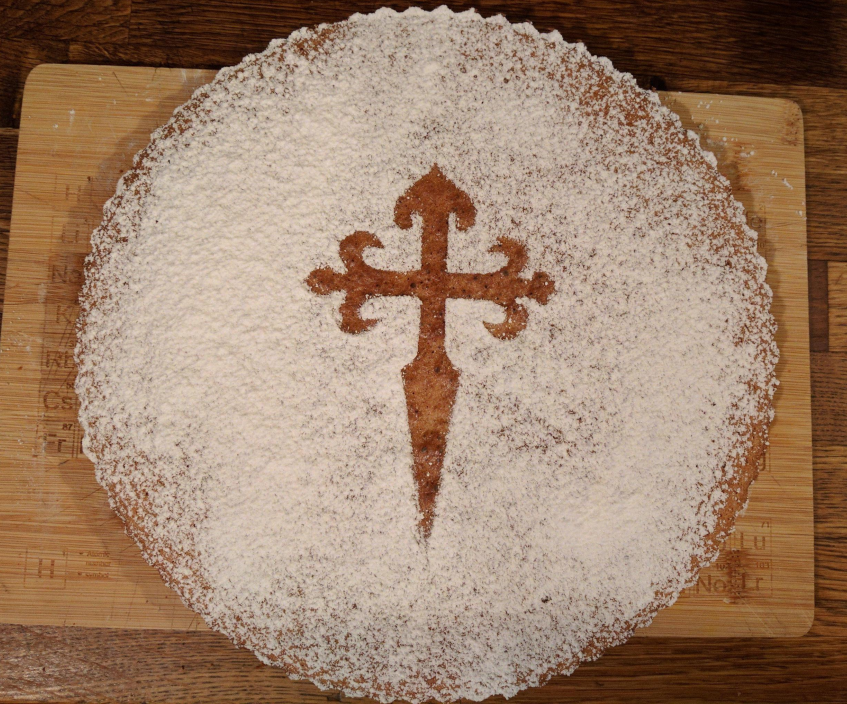

# Targa de Santiago

## Ingredients  

Ingredients for a ~28cm round mold.

- 250g of almonds, either already milled or whole. If whole, it needs to be made into a powder
  mix, with a part of it being very fine flour-like, and another part with more crumbs.
- 5 large eggs
- 200g sugar
- Half a lemon, only to grate
- Half a spoon of cinammon
- Half a shot glass of a nut or herb liquor
- Butter/oil to avoid sticking to the mold
- Powdered sugar for decoration

## Preparation  

1. Once you have the almond powder, put in the oven at ~110C for ~10min, or toast lightly.
   on a pan, to dry the humidity and release oil from the almonds.
2. Mix the eggs, with the sugar, whisking until foams.
3. Grate the lemon skin and add it to the egg mixture, add also the liquor and the
   cinammon.
4. When the almond powder has cooled a bit and is lukewarm, mix it softly into the egg
   mixture
5. Pre-heat the oven to 180C
6. Butter the mold, and spread the mixture in the mold
7. Cook for 25min in the oven, then cover it with aluminium foil (so the surface doesnt
   burn) and leave cooking another 10min, total ~35min, until poking it with a fork comes
   out clean
8. Allow it to cool outside the oven, and once cool, decorate with a thin layer of
   powdered sugar
